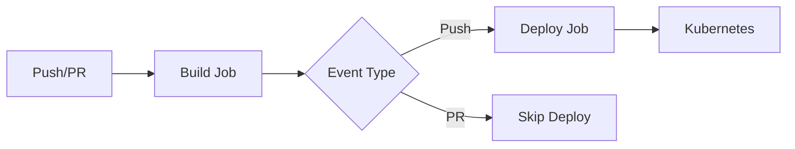

# 🚀 GitHub Migration Guide - ScalyShop v2 Backend

Complete guide for migrating from GitLab to GitHub with GitHub Actions CI/CD.

---

## Table of Contents
- [Quick Start (2 Minutes)](#quick-start-2-minutes)
- [What Was Created](#what-was-created)
- [Key Changes](#key-changes)
- [Detailed Migration Steps](#detailed-migration-steps)
- [GitHub Secrets Configuration](#github-secrets-configuration)
- [Workflow Details](#workflow-details)
- [GitLab vs GitHub Reference](#gitlab-vs-github-reference)
- [Troubleshooting](#troubleshooting)
- [Cleanup](#cleanup)

---

## Quick Start (2 Minutes)

### Prerequisites
- [ ] Create a new repository on GitHub: https://github.com/new
- [ ] Don't initialize it with README, .gitignore, or license

### 🎯 What Gets Migrated

**✅ EVERYTHING is preserved:**
- ✅ **All branches** (main, dev, feat-business-metric, etc.)
- ✅ **Complete commit history** from all branches
- ✅ **All commits** from all contributors
- ✅ **All commit messages** and timestamps
- ✅ **All git tags** (if any)
- ✅ **Author information** for every commit

**Note:** This is a full migration, not a fresh start. Your entire Git history moves to GitHub!

### Automated Migration (Recommended)
```bash
# 1. Run the migration script (it will show you all branches first)
./migrate-to-github.sh

# The script will:
# • List all branches that will be migrated
# • Update configuration files
# • Optionally commit and push ALL branches to GitHub
# • Preserve complete commit history
```

### Configure GitHub Secrets (Required)
```bash
# 1. Get base64-encoded Kubernetes config
cat ~/.kube/config | base64

# 2. Add to GitHub:
#    Go to: Settings → Secrets and variables → Actions → New secret
#    Name: KUBECONFIG
#    Value: <paste the base64 output>

# 3. Enable workflow permissions:
#    Settings → Actions → General
#    ✅ Read and write permissions
#    ✅ Allow GitHub Actions to create and approve pull requests
```

### Test Your Setup
```bash
git checkout dev
git commit --allow-empty -m "Test GitHub Actions"
git push origin dev
# Watch it run in the Actions tab! 🎉
```

---

## What Was Created

### GitHub Actions Workflow
```
.github/
└── workflows/
    └── ci-cd.yml          # Your new CI/CD pipeline (replaces .gitlab-ci.yml)
```

**Workflow Features:**
- 🏗️  **Build Job**: Builds Docker images using Docker Buildx
- 🧪 **Test Job**: Ready to enable (currently commented out)
- 🚀 **Deploy Job**: Deploys to Kubernetes using Helm
- 📦 **Registry**: Publishes to GitHub Container Registry (ghcr.io)
- ⚡ **Caching**: Uses GitHub Actions cache for faster builds
- 🌿 **Branches**: Triggers on main, dev, and feat-business-metric

### Automation Script
- `migrate-to-github.sh` - Automated migration script that updates all necessary files

### Updated Files
- `.gitignore` - Now excludes .DS_Store and GitLab CI files

---

## Key Changes

### Container Registry
```diff
- registry.git.chalmers.se/courses/dat490/students/2025/dat490-2025-9/scalyshop-v2-backend
+ ghcr.io/YOUR_USERNAME/scalyshop-v2-backend
```

### CI/CD Platform
```diff
- GitLab CI (.gitlab-ci.yml)
+ GitHub Actions (.github/workflows/ci-cd.yml)
```

### Image Builder
```diff
- Kaniko executor
+ Docker Buildx (faster with better caching)
```

### Files Modified by Migration Script

#### `scalyshop-backend/values.yaml`
```diff
image:
- repository: registry.git.chalmers.se/courses/dat490/students/2025/dat490-2025-9/scalyshop-v2-backend
+ repository: ghcr.io/YOUR_USERNAME/scalyshop-v2-backend
  pullPolicy: Always
- tag: "v1.0.0"
+ tag: ""  # Will be set by CI/CD

- imagePullSecrets:
-   - name: gitlab-registry-secret
+ # imagePullSecrets:  # Uncomment if using private images
+ #   - name: ghcr-secret
```

#### `package.json`
```diff
"repository": {
  "type": "git",
- "url": "git+https://git.chalmers.se/courses/dat490/group-00-backend.git"
+ "url": "git+https://github.com/YOUR_USERNAME/scalyshop-v2-backend.git"
}
```

---

## Detailed Migration Steps

### Step 1: Create GitHub Repository

1. Go to [GitHub](https://github.com) and create a new repository
2. Name it appropriately (e.g., `scalyshop-v2-backend`)
3. **Important**: Don't initialize with README, .gitignore, or license

### Step 2: Run Migration Script

```bash
./migrate-to-github.sh
```

The script will:
- ✅ Update git remote to point to GitHub
- ✅ Update Helm values.yaml with new image repository
- ✅ Update package.json with new repository URL
- ✅ Create backups of all modified files
- ✅ Show you all branches that will be migrated
- ✅ Optionally push ALL branches and tags to GitHub (preserving all history)

### Step 3: Review Changes

```bash
# Check what was changed
git status
git diff

# Review backup files if needed
ls -la *.backup
```

### Step 4: Push All Branches and History to GitHub

**Important:** The `--all` flag pushes ALL local branches with their complete commit history.

```bash
# If you used the automated script, it already did this!
# Otherwise, push manually:

# Push all branches (preserves complete history)
git push -u origin --all

# Push all tags (if any)
git push -u origin --tags
```

**What this does:**
- Pushes every local branch to GitHub
- Preserves the entire commit history for each branch
- Maintains all commit authors, messages, and timestamps
- All your team's contributions are preserved

**Verify all branches were pushed:**
```bash
# Check on GitHub or run:
git branch -r
```

### Step 5: Configure GitHub Secrets

Go to your repository's **Settings → Secrets and variables → Actions**

#### Required Secret:

**KUBECONFIG** - For Kubernetes deployment
```bash
# Get your kubeconfig and encode it
cat ~/.kube/config | base64

# Copy the output and add it as a secret in GitHub
# Name: KUBECONFIG
# Value: <paste the base64 string>
```

#### Optional Secrets (if needed for private images):

If using Docker Hub or other registries:
- `DOCKER_USERNAME`
- `DOCKER_PASSWORD`

### Step 6: Enable GitHub Actions Permissions

1. Go to **Settings → Actions → General**
2. Under "Workflow permissions":
   - ✅ **Read and write permissions**
   - ✅ **Allow GitHub Actions to create and approve pull requests**

### Step 7: Test the Pipeline

```bash
# Switch to dev branch
git checkout dev

# Make a test commit
git commit --allow-empty -m "Test GitHub Actions CI/CD"

# Push to trigger the workflow
git push origin dev
```

Go to the **Actions** tab in GitHub to watch your workflow run!

---

## GitHub Secrets Configuration

### Creating KUBECONFIG Secret

```bash
# Method 1: Direct base64 encoding
cat ~/.kube/config | base64

# Method 2: Copy to clipboard (macOS)
cat ~/.kube/config | base64 | pbcopy

# Method 3: Copy to clipboard (Linux with xclip)
cat ~/.kube/config | base64 | xclip -selection clipboard
```

Then add it to GitHub:
1. Repository → **Settings** → **Secrets and variables** → **Actions**
2. Click **New repository secret**
3. Name: `KUBECONFIG`
4. Value: Paste the base64-encoded content
5. Click **Add secret**

### Optional: GitHub Container Registry Authentication

For pulling private images in Kubernetes:

```bash
# Create Kubernetes secret for GitHub Container Registry
kubectl create secret docker-registry ghcr-secret \
  --docker-server=ghcr.io \
  --docker-username=YOUR_GITHUB_USERNAME \
  --docker-password=YOUR_GITHUB_PAT \
  --docker-email=your-email@example.com \
  --namespace=scalyshop
```

**Generate Personal Access Token (PAT):**
1. GitHub → Settings → Developer settings → Personal access tokens → Tokens (classic)
2. Generate new token with `read:packages` and `write:packages` scopes
3. Copy and use as `--docker-password`

---

## Workflow Details

### Pipeline Overview



### Build Job
- **Triggers**: On push or pull request to main, dev, feat-business-metric
- **Actions**:
  - Checks out code
  - Sets up Docker Buildx
  - Logs into GitHub Container Registry
  - Builds Docker image for linux/amd64
  - Pushes to ghcr.io with multiple tags
  - Uses GitHub Actions cache for faster builds

**Image Tags Created:**
- `ghcr.io/YOUR_USERNAME/scalyshop-v2-backend:SHA` (commit SHA)
- `ghcr.io/YOUR_USERNAME/scalyshop-v2-backend:main` (branch)
- `ghcr.io/YOUR_USERNAME/scalyshop-v2-backend:dev` (branch)
- `ghcr.io/YOUR_USERNAME/scalyshop-v2-backend:pr-NUMBER` (for PRs)

### Test Job (Currently Disabled)
Uncomment in `.github/workflows/ci-cd.yml` to enable:

```yaml
test:
  name: Run Tests
  runs-on: ubuntu-latest
  needs: build
  
  steps:
    - name: Checkout code
      uses: actions/checkout@v4
    
    - name: Set up Node.js
      uses: actions/setup-node@v4
      with:
        node-version: '22'
        cache: 'npm'
    
    - name: Install dependencies
      run: npm install
    
    - name: Run tests
      run: npm test
```

### Deploy Job
- **Triggers**: Only on push events (not PRs) to main, dev, feat-business-metric
- **Actions**:
  - Checks out code
  - Sets up Helm and kubectl
  - Configures kubectl with KUBECONFIG secret
  - Runs `helm upgrade --install` with current commit SHA
  - Creates namespace if it doesn't exist
  - Waits up to 300 seconds for deployment

---

## GitLab vs GitHub Reference

### CI/CD Variables

| Feature | GitLab CI | GitHub Actions |
|---------|-----------|----------------|
| Config File | `.gitlab-ci.yml` | `.github/workflows/ci-cd.yml` |
| Container Registry | `registry.gitlab.com` or custom | `ghcr.io` |
| Commit SHA (short) | `$CI_COMMIT_SHORT_SHA` | `${{ github.sha }}` (full) |
| Commit SHA (short) | `$CI_COMMIT_SHORT_SHA` | Use `substring(github.sha, 0, 7)` |
| Registry Image | `$CI_REGISTRY_IMAGE` | `ghcr.io/${{ github.repository }}` |
| Branch Name | `$CI_COMMIT_BRANCH` | `${{ github.ref_name }}` |
| Default Branch | `$CI_DEFAULT_BRANCH` | `${{ github.event.repository.default_branch }}` |
| Project Directory | `$CI_PROJECT_DIR` | `${{ github.workspace }}` |
| Runner | `tags: [test]` | `runs-on: ubuntu-latest` |

### Workflow Syntax

| GitLab CI | GitHub Actions |
|-----------|----------------|
| `stages:` | `jobs:` |
| `stage: build` | `jobs.build:` |
| `image: node:latest` | `runs-on: ubuntu-latest` + `container: node:latest` |
| `script:` | `steps:` with `run:` |
| `before_script:` | Add as first step in `steps:` |
| `after_script:` | Add as last step with `if: always()` |
| `rules:` | `if:` conditions in job or workflow |
| `when: on_success` | `if: success()` |
| `when: on_failure` | `if: failure()` |

---

## Troubleshooting

### Issue: Docker Image Push Failed
**Error**: Permission denied or authentication failed

**Solution**:
1. Go to **Settings → Actions → General**
2. Under "Workflow permissions", select **Read and write permissions**
3. Ensure **GITHUB_TOKEN** has package write permissions

### Issue: Kubernetes Deployment Fails
**Error**: Connection refused or authentication failed

**Solutions**:
- Verify KUBECONFIG secret is properly base64 encoded
- Test kubectl locally: `kubectl get nodes`
- Ensure namespace exists or workflow creates it
- Check if kubeconfig is still valid (not expired)

### Issue: Can't See Docker Images
**Error**: Images not visible in Packages

**Solutions**:
- Check https://github.com/YOUR_USERNAME?tab=packages
- Images are private by default - go to package settings → Change visibility
- Verify the build job completed successfully in Actions tab

### Issue: Helm Chart Not Found
**Error**: Chart not found during deployment

**Solutions**:
- Ensure `scalyshop-backend/` directory exists in repository
- Verify `Chart.yaml` is present and valid
- Check the path in the workflow matches your chart location

### Issue: Workflow Not Triggering
**Error**: Push to branch but no workflow runs

**Solutions**:
- Check branch name matches workflow triggers (main, dev, feat-business-metric)
- Ensure workflow file is in `.github/workflows/` directory
- Verify YAML syntax is correct (use a YAML validator)
- Check Actions are enabled: Settings → Actions → General

### Issue: Environment Variables Not Set
**Error**: Variables showing as empty in deployment

**Solutions**:
- Update Helm values.yaml with proper environment variables
- Ensure MongoDB connection details are correct
- Use Kubernetes secrets for sensitive data

---

## Making Packages Public

By default, GitHub Container Registry packages are private. To make them public:

1. Go to https://github.com/YOUR_USERNAME?tab=packages
2. Click on your package (`scalyshop-v2-backend`)
3. Click **Package settings** (bottom right)
4. Scroll to **Danger Zone**
5. Click **Change visibility** → Public
6. Type the repository name to confirm

---

## Cleanup

### After Successful Migration

Once everything is working on GitHub, you can clean up GitLab-specific files:

```bash
# Remove GitLab CI configuration files
git rm .gitlab-ci.yml .gitlab-ci-TEMPLATE.yml

# Commit the cleanup
git commit -m "Remove GitLab CI configuration"

# Push to GitHub
git push origin dev
git push origin main
```

### Remove Backup Files

The migration script creates backup files. Once you've verified everything works:

```bash
# List backup files
ls -la *.backup

# Remove them
rm -f *.backup
git add .
git commit -m "Remove backup files"
git push
```

---

## Advanced Configuration

### Enable Test Job

Edit `.github/workflows/ci-cd.yml` and uncomment the test job section (lines ~45-66).

### Add Branch Protection Rules

1. Go to **Settings → Branches**
2. Click **Add branch protection rule**
3. Branch name pattern: `main` or `dev`
4. Enable:
   - ✅ Require a pull request before merging
   - ✅ Require status checks to pass before merging
   - ✅ Require branches to be up to date before merging
   - Select required checks: `build`, `test` (if enabled)

### Add Workflow Status Badge

Add to your README.md:

```markdown
[](https://github.com/YOUR_USERNAME/scalyshop-v2-backend/actions/workflows/ci-cd.yml)
```

### Use GitHub Environments

For production deployments with additional protection:

1. Go to **Settings → Environments**
2. Create environment: `production`
3. Add protection rules (required reviewers, wait timer, etc.)
4. Update workflow to use environment:

```yaml
deploy:
  environment:
    name: production
    url: https://backend.your-domain.com
```

---

## FAQ

### Q: Will all my branches be migrated?
**A:** Yes! When you use `git push -u origin --all`, ALL your local branches are pushed to GitHub with their complete commit history. The migration script can do this automatically.

### Q: What about commit history?
**A:** Your entire commit history is preserved. Every commit from every branch, including author information, timestamps, and commit messages.

### Q: What if I have many branches?
**A:** No problem! The `--all` flag handles all branches. The script will show you which branches exist before pushing.

### Q: Are tags migrated?
**A:** Yes! Use `git push -u origin --tags` or let the migration script handle it automatically.

### Q: Will contributor information be preserved?
**A:** Absolutely! All commit author information, co-authors, and Git history metadata is fully preserved.

### Q: Can I verify what will be migrated before pushing?
**A:** Yes! The migration script shows you all branches and tags before asking if you want to push. You can also run:
```bash
git branch -a        # See all branches
git log --oneline    # See commit history
git tag              # See all tags
```

---

## Additional Resources

- [GitHub Actions Documentation](https://docs.github.com/en/actions)
- [GitHub Container Registry](https://docs.github.com/en/packages/working-with-a-github-packages-registry/working-with-the-container-registry)
- [Migrating from GitLab CI to GitHub Actions](https://docs.github.com/en/actions/migrating-to-github-actions/migrating-from-gitlab-ci-cd-to-github-actions)
- [Docker Buildx Documentation](https://docs.docker.com/buildx/working-with-buildx/)
- [Helm Documentation](https://helm.sh/docs/)

---

## Summary

### What You Have Now

✅ GitHub Actions workflow that builds, tests, and deploys  
✅ Automatic Docker image publishing to ghcr.io  
✅ Helm-based Kubernetes deployment  
✅ Multi-branch support (main, dev, feat-business-metric)  
✅ Pull request validation (without deployment)  
✅ Automated migration script  

### Migration Checklist

- [ ] Create GitHub repository
- [ ] Run `./migrate-to-github.sh` (it will handle everything!)
  - [ ] Shows all branches that will be migrated
  - [ ] Updates configuration files
  - [ ] Optionally pushes all branches with complete history
- [ ] Verify all branches on GitHub: `git branch -r`
- [ ] Add KUBECONFIG secret
- [ ] Enable workflow permissions
- [ ] Test workflow with empty commit
- [ ] Verify deployment in Kubernetes
- [ ] Make packages public (optional)
- [ ] Remove GitLab CI files (optional)
- [ ] Update README with GitHub badge (optional)

### What's Preserved in Migration

✅ **All branches** (not just current branch)  
✅ **Complete commit history** (every single commit)  
✅ **All contributors** (author information intact)  
✅ **Git tags** (version tags, releases, etc.)  
✅ **Commit metadata** (messages, dates, authors)  
✅ **Branch relationships** (merge history preserved)

---

**Ready to migrate?** Run `./migrate-to-github.sh` and you'll be on GitHub in minutes! 🚀

For questions or issues, review the troubleshooting section above.

